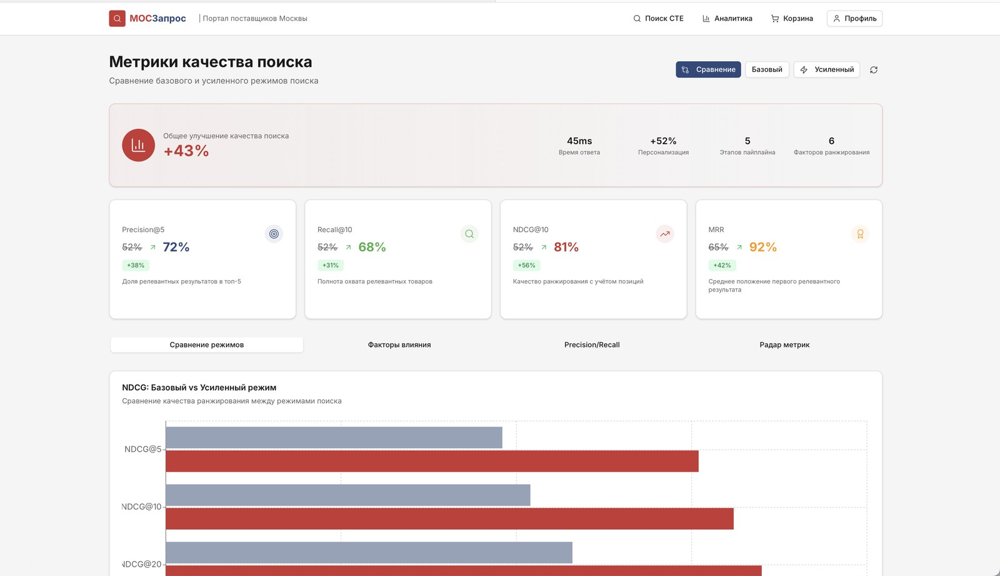
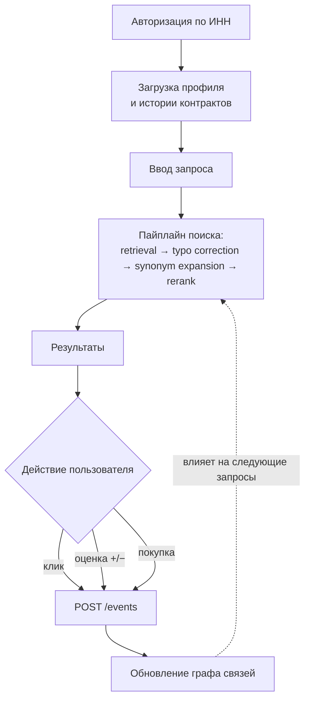
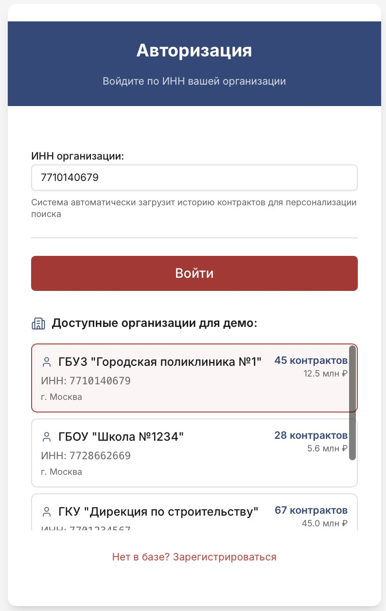
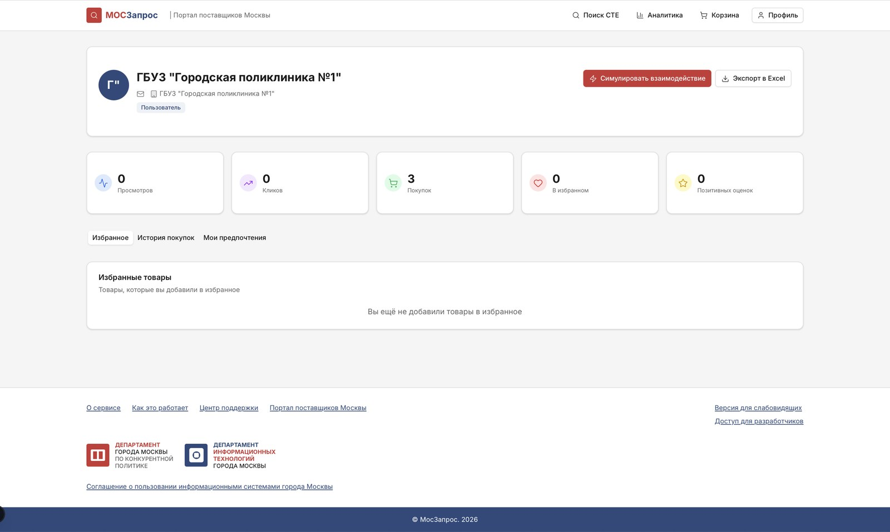
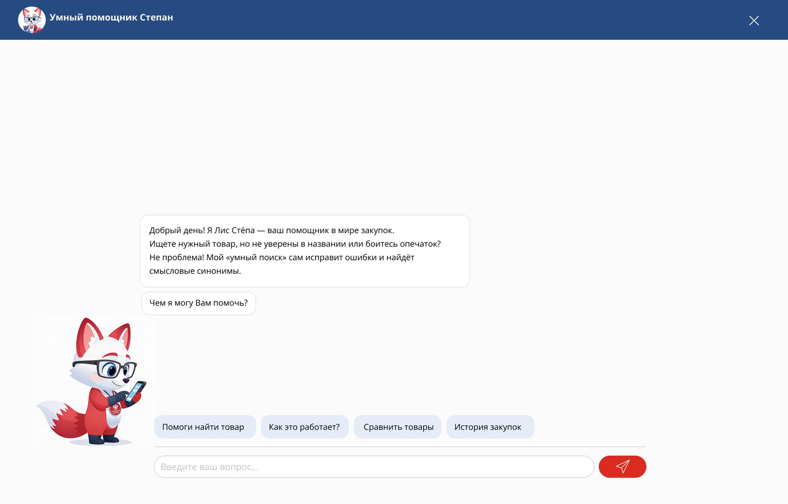
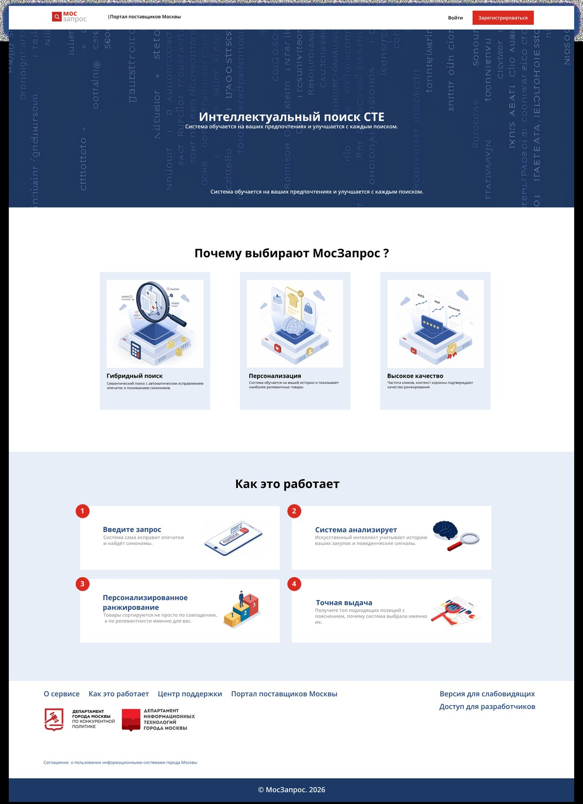

# МосЗапрос

**Интеллектуальный персонализированный поиск по Справочнику товаров (СТЕ) для Портала поставщиков Москвы**

Исправляет опечатки, понимает морфологию и синонимы, учитывает историю закупок организации и дообучается на действиях пользователя

Дашборд качества поиска: сравнение базового текстового поиска и полного пайплайна по Precision, Recall, NDCG и MRR

---

## Содержание

- [О проекте](#о-проекте)
- [Ключевые возможности](#ключевые-возможности)
- [Как работает поиск](#как-работает-поиск)
- [Результаты](#результаты)
- [Интерфейс](#интерфейс)
- [Архитектурные решения](#архитектурные-решения)
- [Демо-сценарий](#демо-сценарий)
- [Моя роль](#моя-роль)

---

## О проекте

Проект создан командой на хакатоне **Tender Hack 2026** по задаче Портала поставщиков Москвы.

**Проблема.** Заказчики ищут нужные позиции в большом справочнике СТЕ. Обычный текстовый поиск не прощает опечаток, не понимает разные формы слова («ручки» / «ручку») и синонимы («авторучка» / «ручка») и выдаёт всем одинаковый результат, хотя поликлинике и школе по запросу «бумага» нужны разные товары.

**Решение.** МосЗапрос — пайплайн умного поиска, который:

1. приводит запрос к нормальной форме и исправляет опечатки;
2. расширяет запрос синонимами;
3. переранжирует выдачу под конкретную организацию на основе истории её контрактов (вход по ИНН);
4. учитывает поведенческие сигналы — клики, оценки, покупки — и обновляет граф предпочтений после каждого действия.

---

## Ключевые возможности

| Возможность | Что это даёт |
|---|---|
| **Гибридный поиск** | Морфология русского языка, исправление опечаток и синонимы: «канцилярия» находит «канцелярию» |
| **Персонализация по ИНН** | При входе загружается история контрактов организации, и ранее закупаемые позиции поднимаются выше |
| **Самообучение на событиях** | Клик, оценка или покупка отправляется в `POST /events` и сразу влияет на следующие выдачи |
| **Граф предпочтений** | Связи «заказчик → категории → товары» с долями закупок для каждой организации |
| **Дашборд метрик** | Сравнение базового и усиленного режимов по Precision@k, Recall@k, NDCG@k, MRR |
| **Профиль организации** | Избранное, история покупок, предпочтения, экспорт в Excel |
| **Помощник «Лис Стёпа»** | Чат-ассистент: поиск товара, сравнение, история закупок |

---

## Как работает поиск

Поиск — это замкнутый цикл: каждое действие пользователя становится сигналом для следующего ранжирования.

Пример того, что видит пайплайн на каждом шаге:

| Шаг | Вход | Результат |
|---|---|---|
| Морфология | «ручки», «ручку» | «ручка» |
| Опечатки | «канцилярия» | «канцелярия» |
| Синонимы | «авторучка» | + «ручка», «перо» |
| Персонализация | ИНН школы | канцелярия и учебное оборудование выше в выдаче |
| Поведение | клик по товару | похожие товары поднимаются в следующих поисках |

---

## Результаты

Качество измерялось на тестовой выборке из 50+ запросов с размеченными релевантными товарами: базовый текстовый поиск сравнивался с полным пайплайном.

| Метрика | Что показывает | Базовый | МосЗапрос | Прирост |
|---|---|:---:|:---:|:---:|
| **Precision@5** | доля релевантных результатов в топ-5 | 52% | **72%** | +38% |
| **Recall@10** | полнота охвата релевантных товаров | 52% | **68%** | +31% |
| **NDCG@10** | качество ранжирования с учётом позиций | 52% | **81%** | +56% |
| **MRR** | насколько высоко первый релевантный результат | 65% | **92%** | +42% |

Время ответа пайплайна — около **45 мс**: 5 этапов, 6 факторов ранжирования.

---

## Интерфейс

### Вход по ИНН и профиль организации

Для демо доступны организации с реальной историей контрактов. После входа система подгружает их для персонализации. В профиле есть статистика взаимодействий, избранное, история покупок, предпочтения, экспорт в Excel и кнопка «Симулировать взаимодействие», которая показывает, как сигналы меняют выдачу.

<table>
  <tr>
    <td width="33%" valign="top"></td>
    <td width="67%" valign="top"></td>
  </tr>
  <tr>
    <td align="center">Авторизация по ИНН и демо-организации</td>
    <td align="center">Профиль: просмотры, клики, покупки, избранное</td>
  </tr>
</table>

### Умный помощник

Чат-ассистент «Лис Стёпа» помогает найти товар, даже если пользователь не уверен в названии, а также сравнивает позиции и показывает историю закупок.

### Главная страница

  

---

## Архитектурные решения

- **Интерпретируемый пайплайн вместо «чёрного ящика».** Связка retrieval + исправление опечаток + синонимы + персонализированный rerank + поведенческие сигналы на данных госзакупок даёт измеримый прирост качества. При этом всегда понятно, почему товар оказался выше.
- **Полностью локальная работа.** Нет зависимости от внешних API, данные о закупках не покидают контур. Для госсектора это важно.
- **Персонализация на уровне ИНН.** Используется история контрактов организации, чувствительные данные пользователей не нужны.
- **PostgreSQL с индексами** как основное хранилище. Пайплайн отвечает за 30–50 мс и масштабируется горизонтально.
- **Событийная обратная связь.** Единая точка `POST /events` для кликов, оценок и покупок. Граф связей обновляется инкрементально.

---

## Демо-сценарий

1. Войти по ИНН, например школы или поликлиники из списка демо-организаций.
2. Ввести запрос с опечаткой: `канцилярия` превращается в `канцелярия`.
3. Посмотреть выдачу: позиции, которые организация уже закупала, стоят выше.
4. Кликнуть по товару и увидеть уведомление о динамической индексации.
5. Повторить поиск: позиции изменились с учётом действия.
6. Открыть «Аналитику» и сравнить базовый и усиленный режимы.

---

## Моя роль

Fullstack-разработка в команде: бэкенд, фронтенд, база данных и дизайн интерфейса.

---

**Автор:** Екатерина Шусталова · [GitHub](https://github.com/katshuuu) · [Telegram](https://t.me/katshuuu)
